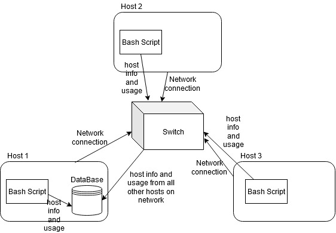

# Linux Cluster Monitoring Agent
## Introduction
This project implements a way to check which computers are in a cluster and their usage. The infrastructure team can used the psql_docker to make a container in which they can keep the RDBMS tables of information for the multiple computers and their usage. Creating the DDL will help in creating the tables needed in the docker container in which the team can use to store the information. The monitoring agent will help them in gathering the cluster information through the use of Linux commands in bash scripts. This monitoring agent is critical to the team as it will provide the information for the computers in the cluster and their usage periodically using crontab, and with this information it can input such collected information to the tables in the docker container. All the scripts, bash or sql will help the infrastructure team determine which computers/nodes are on the cluster and how they are using the resources.

## Architecture and Design


### 1) Tables information

There are two tables that are used, host_info and host_usage. Both the tables collect data about the hosts on the clusters, but they collect different information, though there are some values that the host_usage table collects from the host_info table. Host_id in host_usage is the foreign key for the id primary key in host_info.

host_info collects the following information:

-id: its a serial number that can be used to identfy the host on both tables.
-hostname: get the system host name which will be set as unique value
-cpu_number: the number of cpu cores for the host
-cpu_archetecture: Get the archecture of the host
-cpu_model: Get the host cpu model to identify the cpu used by the host
-cpu_mhz: Get the host cpu clock rate
-L2_cache: Get the L2_cache of the host
-total_mem: Get the total memory of the host in KB size
-timestamp: Get the day and time in UTC for when all this  information  was collected for host_info table

host_usage collects the information about each host's usage at the time. Working together with crontab, it can collect the data every 5 mins and insert that data into the table. This table shows the usage change after each period.

-timestamp: Get the UTC day and time for when the host_usage information had been collected.
-host_id: Get the id from the host_info table for which this information is being collected for.
-memory_free: Current free memeory for the host in MB
-cpu_idle: Percentage of cpu that is currently idle
-cpu_kernal: Percentage of cpu kernel
-disk_io: the current number of I/O in disk
-disk_available: The amount of disk space that is currently available in MB


### 2) Describe scripts

psql_docker.sh: create/start/stop docker container that will hold the tables. This script has to be ran before all the other scripts as this will allow the access to the tables. 

ddl.sql: TO create the host_info and host_usage tables in the docker container, this script will create the tables if they have not already been created. It is a good measure to run this script just to make sure the tables exists before the data starts being collected and is attempted to instert into those table

host_info.sh: This script will run the linux commands that will gather the host_info values mentioned above. The values will be assigned to variables, after which it will run a psql command to instert the values into the host_infor tabl 

host_usage.sh: This script will also have linux commands collecting the information needed and then inserting the into the host_usage table. This script needs host_info.sh scrip to executed atleast once before as the host_id for this table is from host_info table. 

queries.sql: This script will run two queries on the host_info and host_usage table. The first script will group the hosts by thier cpu number and sort those groups by thier memory size in decending order.

## Usage
#### 1) how to init database and tables

-to create a database, run the following commands:
```
#connect to the psql instance
psql -h localhost -U postgres -W

#list all database
postgres=# \l

#create a database
postgres=# CREATE DATABASE host_agent;

#connect to the new database;
postgres=# \c host_agent;
```

-Now that the database has been created, the following command can be ran to create the table if they have not already been created.
```
#run the following command to create host_info and host_usage table
psql -h localhost -U postgres -W -d host_agent -f sql/ddl.sql
```

#### 2) host_info.sh script
This scrip only needs to be ran once to collect the host information for each host.
```
#run the following command to insert the host information
./scripts/host_info.sh psql_host psql_port db_name psql_user psql_password
```


#### 3) host_usage.sh script
The host_usage.sh script can be executed multiple times for each host to keep gathering data about the usage.
```
#run the following command to execute the host_usage script. 
scripts/host_usage.sh psql_host psql_port db_name psql_user psql_password
```

#### 4) crontab setup
The following commands will help in setting up crontab, which will execute the host_usage.sh script every 5 minutes so data for host usage can be retreived and inserted every 5 minutes. These commands are in bash
```
#edit crontab jobs
bash> crontab -e

#add this to crontab
* * * * * bash /home/centos/dev/jrvs/bootcamp/linux_sql/host_agent/scripts/host_usage.sh localhost 5432 host_agent postgres password > /tmp/host_usage.log

#check that the crontab has been created
crontab -ls

#check that the crontab is collecting data as intented
cat /tmp/host_usage.log
```


## Improvements 
1) The ddl.sql script needs to be improved to include the switch to host_agent in the database. This improvement would allow for the script to automatically switch to host_agent database, which holds the tables host_info and host_usage. With this improvement, we would not have to manually switch to host_agent and can run queries in the same same such as displaying the tables.

2) Implementing the host node failure in the queries.sql script. This would allow to check which host nodes failed in writing the usage data to the database. This can allow more information on the indiviual hosts and perhaps even figure out which hosts should be checked if they are failing alot.

3) Create a script for the initialzation of the database and host_agent. This would allow the user to run the script alone to initialze the database rather than having to manually run the individual command lines to set the database. Also, this would make sure that some wouldnt make any mistakes in setting up the database if they execute the commands wrong. 

